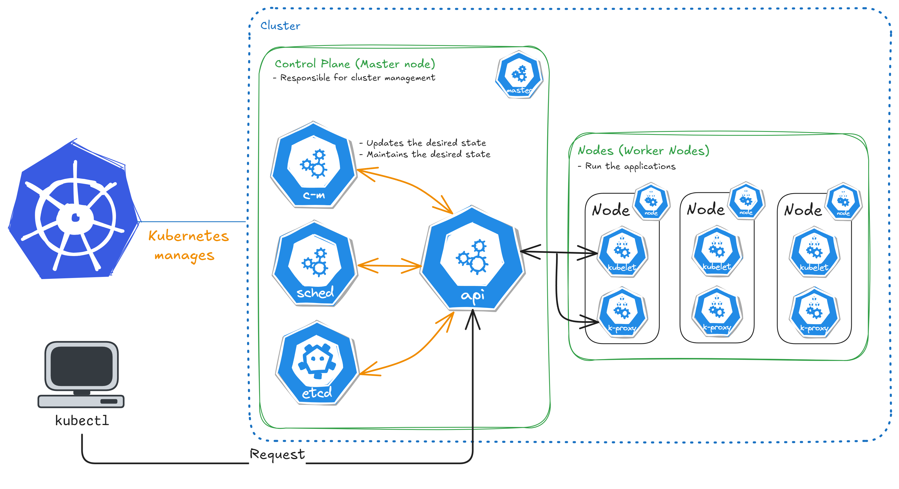

# Kubernetes Navigation 🌊🚢 

⚓ Imagine that you have an application that needs to run many containers. If you run all these containers in a single machine, it can become overload and stop working. The **Kubernetes** handles this problem very well. It **manages** a group of machines called a **cluster** that work together to execute these containers. With **Kubernetes** you can provide new containers and resources to the **cluster** depending on your application needs. This ability is called **"Horizontal Scale"** and the ability to manage and automate the execution of containers is called **Container Orchestration**. 

**Kubernetes** is much more than a container orchestration, it have many resources that turns the developer job so much easier. 

Lets quickly take a look in the basic archictecture of the orchestration:

Exploring the cluster structure we can see that is composed of **master** and **worker** nodes:
* The **master** one is responsible for cluster management.
* The **worker** one is responsible for run our applications, in other words, execute the Pods.

We can going deeper and aware the other resources like **c-m** thats the meaning **Control-Manager**, **sched** thats the meaning **Scheduler**, **etcd** and **api**. These resources make up the **Control Plane** of the **cluster** that is responsible for cluster management.

* **c-m** is responsible for store and update the desired state
* **sched** is responsible for define where the Pod will be executed in the cluster.
* **etcd** is responsible for store all the cluster data through a key-value pair database.
* **api** is responsible for receive and execute new commands. It is a Rest API.

Inside de **Node** component we found the **kubelet** and **kubeproxy**. They make up the **Nodes**, **Control Plane Nodes**:

* **kubelet** is responsible for execute the Pods inside the nodes.
* **kubeproxy** is responsible for the communication between nodes and cluster.

So, for each node we have a **kubelet** and a **kubeproxy** and the **api** is responsible for communication between all these components. The **api** will receives the requests with the commands of it should do. But, how it can do that? Our machine doesn't know how to do this alone. We need some tool with the ability to communicate with the Rest API of the cluster (the **api** resource). We need a tool called `kubectl`.

With `kubectl` we can *create*, *read*, *update* and *delete* the resources of the cluster, the components of the cluster.

Every command we run with `kubectl` is a request for the Rest API of the cluster, for the **api** resource.
