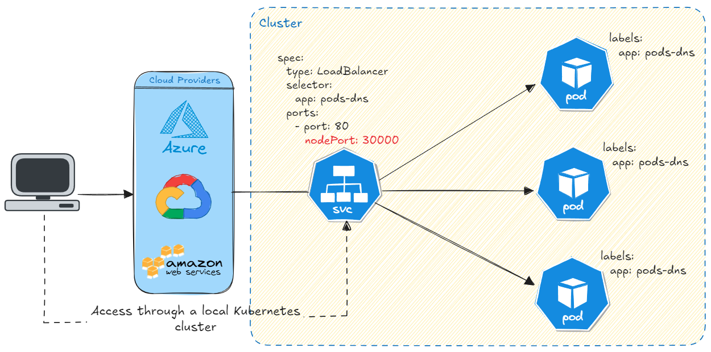

# Pods ⚛️

Aspects and true about Pod:

- It is the smallest unit in **Kubernetes**.
- **Pods** are made up of one or more containers.
- With `kubectl` we always create a **Pod**, not a container.
- A *Pod* is considered terminated when all of its containers stop working. If only one container is running, the Pod is considered healthy.

In the following representation we can see that the **Pod** has its own IP address and the containers within it share the same IP address. This allows the containers within the same **Pod** to communicate directly via localhost, facilitating communication between them.


**Pods** are ephemeral which is why Kubernetes can create and destroy them at any time. If a **Pod** fails, Kubernetes can create another one and replace it, but not necessarily with the same IP address.

## Pods Cheatsheets 👨🏽‍💻

The following commands are being executed imperatively.

```bash
# create a Pod with a container using the ngnix image
kubectl run $pod_name --image=$image_name:$image_version

# show Pods from cluster
kubectl get pods

# show Pods from cluster following the events in real time state
kubectl get pods --watch

# describe a Pod
kubectl describe pods $pod_name 

# deletes a Pod
kubectl delete pods $pod_name

# edit the properties and configurations from Pod
kubectl edit pods $pod_name

# Log more information about the pods and other resources
kubectl get pods -o wide
```

## Where are images downloaded to Pod containers stored?

When we decide that a new **Pod** will be executed, the **Scheduler** (**sched**) decides in which **Node** this will happen. Then the images downloaded from the Docker Hub will be stored locally on each **Node**, and will not be shared, by default, between all cluster. 

## How create Pod declaratively?

We need a `.yaml` file with the following specifications:

```yaml
# nginx-pod.yaml

apiVersion: v1
kind: Pod
metadata:
  name: nginx-pod
spec:
  containers:
    - name: nginx-container
      image: nginx:stable
```
By executing the `kubectl apply -f nginx-pod.yaml` command, a **Pod** must be created on the cluster **Node**.

To destroy the pod declaratively, you can run `kubectl delete -f nginx-pod.yaml` command.

# Services 

One of the **Services** responsabilities, is communication between **Pods** within the cluster. The **Services** resolve the instability of the **Pod** IPs, which can change at any time. It makes a fixed access point, with IP and DNS to allow **Pods** to communicate with each other, even if the **Pod** restarted or its IP has changed.

There are three types of **Services**: **ClusterIP**, **NodePort** and **LoadBalancer**, each with its own specifications and characteristics.

## ClusterIP:

The **ClusterIP** is a type of **Service** whose responsibility is communication between its **Pods** within the cluster. It works as a fixed address for a specific **Pod**, allowing other **Pods** to communicate with it stably, even if the **Pod**'s IP changes.


The **Service** knows which pods to manage by defining `labels` in the `metadata` and using the `selector` field. In other words, `labels` are responsible for defining the relationship between the **Service** and the **Pod**.

> The **ClusterIP** only works within the Cluster.
## NodePort

The **NodePort** works like a **ClusterIP**, but also exposes the application to the outside world through a specific **Kubernetes Node port**.

To access the application through **NodePort**, it is necessary to use the Kubernetes Node port IP and the port defined in the service. This can be illustrate in the diagram below:


In the result of the command below we can see some properties of the **NodePort** service, `srv-pod`. Inside the cluster, the service listens on port `80`, while outside the cluster it listens on port `30000`. 

```bash
> kubectl get services

NAME         TYPE        CLUSTER-IP       PORT(S)  
srv-pod    NodePort    10.107.148.12    80:30000/TCP
```

We use the Kubernetes node port IP to access the service though on port `30000`.

```bash
> kubectl get nodes

NAME       STATUS   ROLES           INTERNAL-IP    
minikube   Ready    control-plane   192.168.49.2
```

> The **NodePort** exposes **Pods** inside and outside the cluster.

## LoadBalancer

The **LoadBalancer** is a **Service** that allows you to access pods outside the cluster. It is also a **NodePort** and a **ClusterIP**. It is like a "gate" in front of Kubernetes cluster that directs traffic to the right pods. It can be easily integrated with Load Balancers from many cloud providers like AWS, Google Cloud or Azure.



# ConfigMap