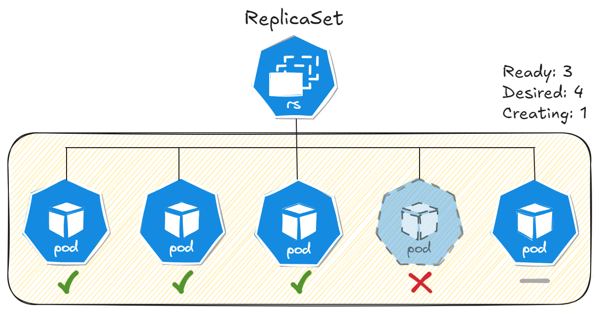
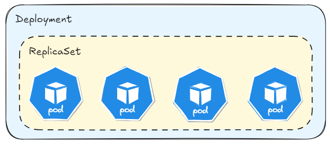

# ReplicaSet

**ReplicaSet** makes your application always available, even if a **Pod** fails. It allows you to have several "replicas" of the application (**Pods**) running at the same time. This is very important to deal with high traffic on the application or ensure that it is always available. In the other words, **ReplicaSet** can manages one or more Pods.



We can see in the Kubernetes manifest below how to declare a **ReplicaSet**:

```yml
apiVersion: apps/v1
kind: ReplicaSet
metadata:
  name: nginx-replicaset
spec:
  # Three nginx application replicas
  replicas: 3 
  selector:
    # Ensure that ReplicaSet manages Pods with the same label
    matchLabels:
      app: nginx-app
  # Defines the Pod model that will be replicated
  template: 
    metadata:
      name: nginx-app
      labels:
        app: nginx-app
    spec:
      containers: 
        - name: nginx-container
          image: nginx:stable
          ports:
            - containerPort: 80
```

# Deployments

A *Deployment* is just a layer above the **ReplicaSet**. It allows you to manage the version of images and **Pods**, like a Git repository. It is like a version control for your applications in Kubernetes.



With **Deployments** you can:
- Create, update and manages Pods in an automated way.
- Control the versions **Pods** and images.
- Rollback to previous versions.
- Record the changes you make as a commit history.

Commands to check the history versions from the **Deployment**:

```bash
# show the history from a specific Deployment
kubectl rollout history deployment $deployment_name

# change the message from the current Deployment revision
kubectl annotate deployment $deployment_name kubernetes.io/change-cause="$message_about_the_change"

# apply rollback for some Deployment revision
kubectl rollout undo deployment $deployment_name --to-revision=$number_of_deployment_revision
```

> Pods are tipically created through **Deployments** rather than individually.

# Volumes